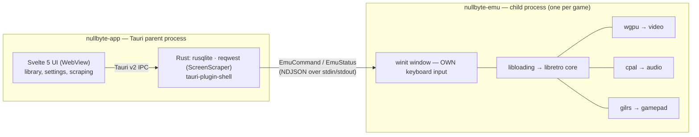

<div align="center">

# Nullbyte

**A modern retro game emulation frontend for macOS and Linux**

Nullbyte loads libretro cores and gives them the UI retro emulation deserves.

[](https://www.rust-lang.org)
[](https://v2.tauri.app)
[](https://svelte.dev)
[](LICENSE)

🇬🇧 English | [🇱🇹 Lietuviškai](README.lt.md)

</div>

---

## What this is

Nullbyte is a **frontend**, not an emulator. It doesn't implement any emulation itself — instead
it loads [libretro](https://docs.libretro.com) cores (the same libraries RetroArch uses) and
wraps them in a fast, tidy, keyboard-driven UI.

The idea is simple: RetroArch has the best emulation ecosystem, but its interface was built for
TVs and game controllers. OpenEmu has a beautiful interface, but only runs on macOS and uses its
own closed core system that's barely maintained anymore. Nullbyte tries to take the best of both.

### Where the name comes from

**null** + **byte** — the zero byte, the lowest level of data. Old games were just bytes in
memory; Nullbyte brings them back to the screen. The logo is `0x00`.

### How it compares

| | RetroArch | OpenEmu | **Nullbyte** |
|---|---|---|---|
| Core system | libretro | own `.oecoreplugin` | **libretro** |
| Platforms | everything | macOS only | **macOS + Linux** |
| UI technology | custom menu driver | AppKit / SwiftUI | **Svelte 5 + Tailwind** |
| Metadata | thumbnails repo | OpenVGDB (offline) | **ScreenScraper API** |
| Gameplay video | no | no | **yes** |
| ROM identification | by filename | filename / hash | **CRC32 + MD5 + SHA1** |

---

## Features

> Below is the full TARGET MVP feature list, not just what's already working. For what's
> actually done today, see "Roadmap" below.

### Library

- **Automatic ROM scanning** — point it at directories, Nullbyte finds and identifies games
- **Hash-based identification** — CRC32, MD5, and SHA1, not guessing from the filename
- **Archive support** — `.zip` and `.7z` read directly, no unpacking needed
- **Gameplay video preview** — hovering over a game plays a short gameplay clip
- **Covers, screenshots, logos, descriptions** — pulled automatically from ScreenScraper
- **Fast search and filtering** — by platform, genre, year, last played
- **Virtualized grid** — smooth even with thousands of games

### Emulation

- **Any libretro core** — if it runs in RetroArch, it runs here
- **Accurate timing** — frame rate comes from the core (SNES 60.098 Hz, not a rounded 60)
- **Audio-driven sync** with dynamic rate control — no crackling, no drift
- **GPU rendering** via wgpu (Metal on macOS, Vulkan on Linux)
- **Save states** with a preview thumbnail
- **Automatic SRAM saving** — progress is never lost
- **Gamepad support** — any USB / Bluetooth controller via `gilrs`

### Interface

- Dark theme by default
- Keyboard navigation and a command palette
- Settings without XML or hand-edited config files

---

## Supported platforms

Nullbyte supports anything with a libretro core whose rendering path the frontend can currently
serve. **The MVP frontend only feeds the core a CPU-side pixel buffer**
(`retro_video_refresh_t` with raw bytes) — cores that draw via OpenGL/Vulkan/D3D themselves and
require a GL context and framebuffer from the frontend (`RETRO_ENVIRONMENT_SET_HW_RENDER`) are
not supported during the MVP (see "Requires hardware rendering" below and the MVP.md §15 v0.2
list).

### Works during the MVP (software rendering)

| Console | Recommended core |
|---|---|
| Nintendo (NES / Famicom) | Nestopia UE, FCEUmm |
| Super Nintendo (SNES) | Snes9x, bsnes-mercury |
| Game Boy / Color | Gambatte, SameBoy |
| Game Boy Advance | mGBA |
| Nintendo DS | melonDS (software renderer), DeSmuME |
| Sega Master System / Game Gear | Genesis Plus GX |
| Sega Genesis / Mega Drive / CD | Genesis Plus GX, PicoDrive |
| Sega 32X | PicoDrive |
| Sega Saturn | Beetle Saturn |
| Sony PlayStation | Beetle PSX |
| Atari 2600 | Stella |
| Atari 7800 | ProSystem |
| Atari 800 / 5200 | Atari800 |
| PC Engine / TurboGrafx-16 | Beetle PCE |
| Neo Geo / Arcade | FinalBurn Neo, MAME |
| Vectrex | vecx |
| Intellivision | FreeIntv |
| Magnavox Odyssey² | O2EM |

### Requires hardware rendering (post-MVP)

These cores require `RETRO_ENVIRONMENT_SET_HW_RENDER` (a GL/Vulkan context from the frontend) —
in practice they have no usable software fallback. Support is planned post-MVP (see MVP.md §15).

| Console | Core (would require HW render) |
|---|---|
| Nintendo 64 | Mupen64Plus-Next, ParaLLEl N64 |
| GameCube / Wii | Dolphin |
| Sony PSP | PPSSPP |

> Nullbyte does not ship cores. Download them yourself from
> [buildbot.libretro.com](https://buildbot.libretro.com/nightly/) or via your system's package
> manager.

---

## System requirements

| | Minimum | Recommended |
|---|---|---|
| **macOS** | 12 Monterey | 14 Sonoma+ |
| **Linux** | glibc 2.31+, Vulkan 1.1 | Vulkan 1.3, Wayland or X11 |
| **CPU** | dual-core x86-64 or Apple Silicon | 4+ cores |
| **RAM** | 4 GB | 8 GB (for GameCube/PSP cores) |
| **GPU** | anything with Metal / Vulkan support | — |

---

## Installation

> **The MVP is still in progress (~46%, see Roadmap below) — there are no releases yet.** For
> now the only way to run Nullbyte is to build it yourself — see "Development" below. This
> section describes what installation will look like once the first release ships.

### Prebuilt builds

Download from [Releases](https://github.com/montynau/nullbyte/releases):

- **macOS:** `Nullbyte_x.y.z_universal.dmg` (Intel + Apple Silicon)
- **Linux:** `nullbyte_x.y.z_amd64.AppImage` or `.deb`

First launch on macOS: `System Settings → Privacy & Security → Open Anyway`
(the app isn't notarized yet).

Linux AppImage:

```bash
chmod +x nullbyte_x.y.z_amd64.AppImage
./nullbyte_x.y.z_amd64.AppImage
```

---

## Development

### Dependencies

**Common:**

```bash
# Rust
curl --proto '=https' --tlsv1.2 -sSf https://sh.rustup.rs | sh

# Node.js 20+ and pnpm
npm install -g pnpm
```

**macOS:**

```bash
xcode-select --install
```

**Linux (Debian / Ubuntu):**

```bash
sudo apt update
sudo apt install libwebkit2gtk-4.1-dev build-essential curl wget file \
  libxdo-dev libssl-dev libayatana-appindicator3-dev librsvg2-dev \
  libasound2-dev libudev-dev
```

**Linux (Fedora):**

```bash
sudo dnf install webkit2gtk4.1-devel openssl-devel curl wget file \
  libappindicator-gtk3-devel librsvg2-devel alsa-lib-devel systemd-devel
sudo dnf group install "C Development Tools and Libraries"
```

**Linux (Arch):**

```bash
sudo pacman -S webkit2gtk-4.1 base-devel curl wget file openssl \
  libappindicator-gtk3 librsvg alsa-lib
```

### Running it

```bash
git clone https://github.com/montynau/nullbyte.git
cd nullbyte

pnpm install
cp .env.example .env       # fill in your ScreenScraper credentials

pnpm tauri dev
```

### Useful commands

```bash
pnpm dev            # frontend only, no Tauri (faster for UI work)
pnpm tauri dev      # full dev mode
pnpm tauri build    # production build
pnpm check          # svelte-check + tsc
pnpm lint           # eslint + prettier --check
pnpm format         # prettier --write

cargo test    --workspace
cargo clippy  --workspace --all-targets -- -D warnings
cargo fmt     --all
```

---

## Configuration

### Cores directory

Nullbyte looks for libretro cores in these paths:

| Platform | Path |
|---|---|
| macOS | `~/Library/Application Support/Nullbyte/cores/` |
| Linux | `~/.local/share/nullbyte/cores/` |

You can add extra directories in settings. After downloading a core (`*_libretro.dylib` /
`*_libretro.so`), just drop it there — Nullbyte will detect it automatically.

### BIOS files

Some systems (PlayStation, Saturn, PC Engine CD) need original BIOS files:

| Platform | Path |
|---|---|
| macOS | `~/Library/Application Support/Nullbyte/system/` |
| Linux | `~/.local/share/nullbyte/system/` |

### ScreenScraper

Metadata and video need a [ScreenScraper](https://www.screenscraper.fr) account. Registration
is free; without an account the quota is practically zero.

`.env` file:

```env
SCREENSCRAPER_DEV_ID=your_dev_id
SCREENSCRAPER_DEV_PASSWORD=your_dev_password
```

Your user login/password is entered in the app's settings and stored locally.

> Dev credentials are obtained by writing to the ScreenScraper admins on their forum. They
> **never** end up in the repository.

### Data

| Platform | Data directory |
|---|---|
| macOS | `~/Library/Application Support/Nullbyte/` |
| Linux | `~/.local/share/nullbyte/` |

```
nullbyte/
├── nullbyte.db        # SQLite: library, settings, metadata cache
├── cores/             # libretro cores
├── system/            # BIOS files
├── saves/             # SRAM (.srm)
├── states/            # save states
└── media/             # covers, screenshots, video
```

---

## Architecture

Nullbyte runs as **two processes**, not one — a parent process (Tauri UI + library) and a
separate child process for each running game (window + emulation). Reason: a Tauri `Window`
without a webview has no keyboard API, and libretro cores' global (not thread-local) state
doesn't allow switching cores without a clean process restart — a separate child process solves
both problems in one step.



Only lightweight control messages cross the process IPC boundary (start/pause/stop, status
reports) — video and audio never cross it. Emulation in the child process runs on a dedicated
thread; frames and audio samples travel through lock-free buffers so the UI/main thread never
blocks emulation. For more detail (ADR-016 and the full decision log) — see
[CLAUDE.md](CLAUDE.md) and [MVP.md](MVP.md) §14.

---

## Roadmap

### MVP (v0.1)

- [x] Project decisions and documentation
- [x] libretro core loading and launching
- [x] Video (wgpu) and audio (cpal)
- [x] Child process architecture + IPC (`nullbyte-emu` ↔ `nullbyte-app`, ADR-016)
- [ ] Gamepad and keyboard input mapping (detection and raw input already work —
      DualShock 4/keyboard verified for real; physical button → action binding not yet)
- [ ] ROM scanning and SQLite library
- [ ] ScreenScraper metadata + video preview
- [ ] Save states and SRAM
- [ ] Settings screen

~46% of MVP tasks complete (see the [MVP.md](MVP.md) progress table). Full plan is there too.

### v0.2

- [ ] Hardware-rendered core support (N64, GameCube, PSP)
- [ ] Core options UI (per-core settings)
- [ ] Shaders (CRT, scanlines, xBRZ)
- [ ] Netplay
- [ ] Rewind
- [ ] Achievements (RetroAchievements)

### v0.3+

- [ ] Core downloader built into the app
- [ ] Playlists and collections
- [ ] Stats (playtime, most played)
- [ ] Light theme
- [ ] Localization
- [ ] Windows support

---

## Legal

**Nullbyte is legal software.** Emulators and emulation frontends are legal in most
jurisdictions.

However:

- **Nullbyte does not provide, distribute, or point to ROM or BIOS files.**
- Downloading ROMs from the internet without owning the original game is copyright
  infringement in most countries.
- BIOS files are copyrighted by their manufacturers and must be dumped from your own hardware.
- You are responsible for making sure any ROM and BIOS files you have were obtained legally.

Requests to add ROM sources will be closed without discussion.

---

## Contributing

Pull requests are welcome. Before starting:

1. Read [CLAUDE.md](CLAUDE.md) — it covers architecture and conventions
2. Check [MVP.md](MVP.md) — it might already be planned
3. Open an issue first for larger changes

Requirements for a PR:

```bash
cargo clippy --workspace --all-targets -- -D warnings
cargo test   --workspace
pnpm check
pnpm lint
```

Commits — [Conventional Commits](https://www.conventionalcommits.org).

---

## Acknowledgements

- [libretro / RetroArch](https://www.libretro.com) — the core ecosystem this project couldn't exist without
- [OpenEmu](https://openemu.org) — inspiration for what an emulation UI *can* look like
- [ScreenScraper](https://www.screenscraper.fr) — metadata and media database
- [Tauri](https://tauri.app), [Svelte](https://svelte.dev), [shadcn-svelte](https://shadcn-svelte.com)
- All the core developers — Snes9x, mGBA, Genesis Plus GX, Mupen64Plus, Beetle, Dolphin, PPSSPP, and others

---

## License

MIT — see [LICENSE](LICENSE).

Libretro cores have their own separate licenses (usually GPL). Nullbyte loads them dynamically
at runtime and does not distribute them.
