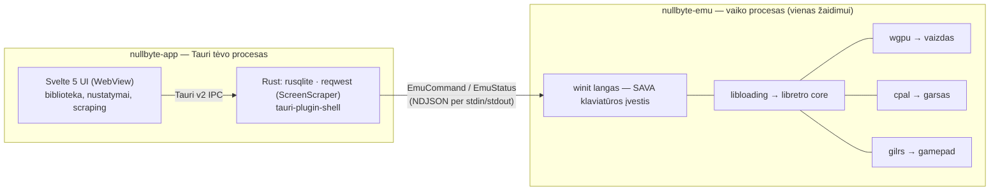

<div align="center">

# Nullbyte

**Modernus retro žaidimų emuliavimo frontend'as macOS ir Linux**

Nullbyte įkelia libretro core'us ir suteikia jiems UI, kokio retro emuliacija nusipelnė.

[](https://www.rust-lang.org)
[](https://v2.tauri.app)
[](https://svelte.dev)
[](LICENSE)

</div>

---

## Kas tai

Nullbyte yra **frontend'as**, ne emuliatorius. Jis nesukuria savo emuliavimo kodo — vietoj to
įkelia [libretro](https://docs.libretro.com) core'us (tas pačias bibliotekas, kurias naudoja
RetroArch) ir apvelka jas greitu, tvarkingu, klaviatūra valdomu UI.

Idėja paprasta: RetroArch turi geriausią emuliavimo ekosistemą, bet jo sąsaja sukurta
televizoriui ir žaidimų konsolėms. OpenEmu turi gražią sąsają, bet veikia tik macOS ir naudoja
savo uždarą core sistemą, kurios beveik niekas nebeprižiūri. Nullbyte bando paimti geriausias
abiejų puses.

### Iš kur pavadinimas

**null** + **byte** — nulinis baitas, žemiausias duomenų lygis. Seni žaidimai ir buvo tik
baitai atmintyje; Nullbyte grąžina juos į ekraną. Logotipe — `0x00`.

### Kuo skiriasi

| | RetroArch | OpenEmu | **Nullbyte** |
|---|---|---|---|
| Core sistema | libretro | sava `.oecoreplugin` | **libretro** |
| Platformos | visos | tik macOS | **macOS + Linux** |
| UI technologija | savas menu driver | AppKit / SwiftUI | **Svelte 5 + Tailwind** |
| Metaduomenys | thumbnails repo | OpenVGDB (offline) | **ScreenScraper API** |
| Gameplay video | ne | ne | **taip** |
| ROM atpažinimas | pavadinimu | pavadinimu / hash | **CRC32 + MD5 + SHA1** |

---

## Funkcijos

> Žemiau — pilnas TIKSLINIS MVP funkcijų sąrašas, ne vien jau veikiantis. Kas realiai
> padaryta šiandien — žr. „Roadmap" žemiau.

### Biblioteka

- **Automatinis ROM skenavimas** — nurodai katalogus, Nullbyte suranda ir atpažįsta žaidimus
- **Hash pagrįstas atpažinimas** — CRC32, MD5 ir SHA1, ne spėliojimas pagal failo pavadinimą
- **Archyvų palaikymas** — `.zip` ir `.7z` skaitomi tiesiogiai, be išpakavimo
- **Gameplay video preview** — užvedus pelę ant žaidimo groja trumpas gameplay įrašas
- **Viršeliai, screenshot'ai, logotipai, aprašymai** — automatiškai iš ScreenScraper
- **Greita paieška ir filtravimas** — pagal platformą, žanrą, metus, paskutinį žaidimą
- **Virtualizuotas grid'as** — sklandu net su tūkstančiais žaidimų

### Emuliavimas

- **Bet koks libretro core** — jei veikia RetroArch'e, veiks ir čia
- **Tikslus timing** — kadrų dažnis imamas iš core (SNES 60.098 Hz, ne apvalinta 60)
- **Audio-driven sinchronizacija** su dynamic rate control — be traškesių ir drifto
- **GPU atvaizdavimas** per wgpu (Metal macOS, Vulkan Linux)
- **Save states** su preview paveiksliuku
- **Automatinis SRAM išsaugojimas** — progresas neprapuola
- **Gamepad palaikymas** — bet koks USB / Bluetooth valdiklis per `gilrs`

### Sąsaja

- Tamsi tema kaip numatytoji
- Klaviatūros navigacija ir command palette
- Nustatymai be XML ir be konfigūracijos failų redagavimo ranka

---

## Palaikomos platformos

Nullbyte palaiko viską, kam yra libretro core'as ir kurio core'o rendering keliui frontend'as
šiuo metu geba tarnauti. **MVP frontend'as duoda core'ui tik CPU pusėje paruoštą pikselių
buferį** (`retro_video_refresh_t` su žaliaviniais baitais) — core'ai, kurie patys piešia per
OpenGL/Vulkan/D3D ir reikalauja iš frontend'o GL konteksto bei framebuffer'io
(`RETRO_ENVIRONMENT_SET_HW_RENDER`), MVP metu nepalaikomi (žr. „Reikalauja hardware
rendering" žemiau ir MVP.md §15 v0.2 sąrašą).

### Veikia MVP metu (software rendering)

| Konsolė | Rekomenduojamas core |
|---|---|
| Nintendo (NES / Famicom) | Nestopia UE, FCEUmm |
| Super Nintendo (SNES) | Snes9x, bsnes-mercury |
| Game Boy / Color | Gambatte, SameBoy |
| Game Boy Advance | mGBA |
| Nintendo DS | melonDS (software renderer), DeSmuME |
| Sega Master System / Game Gear | Genesis Plus GX |
| Sega Genesis / Mega Drive / CD | Genesis Plus GX, PicoDrive |
| Sega 32X | PicoDrive |
| Sega Saturn | Beetle Saturn |
| Sony PlayStation | Beetle PSX |
| Atari 2600 | Stella |
| Atari 7800 | ProSystem |
| Atari 800 / 5200 | Atari800 |
| PC Engine / TurboGrafx-16 | Beetle PCE |
| Neo Geo / Arcade | FinalBurn Neo, MAME |
| Vectrex | vecx |
| Intellivision | FreeIntv |
| Magnavox Odyssey² | O2EM |

### Reikalauja hardware rendering (post-MVP)

Šie core'ai reikalauja `RETRO_ENVIRONMENT_SET_HW_RENDER` (GL/Vulkan kontekstas iš
frontend'o) — praktiškai neturi naudojamo software fallback'o. Palaikymas planuojamas
po MVP (žr. MVP.md §15).

| Konsolė | Core (reikalautų HW render) |
|---|---|
| Nintendo 64 | Mupen64Plus-Next, ParaLLEl N64 |
| GameCube / Wii | Dolphin |
| Sony PSP | PPSSPP |

> Nullbyte nepateikia core'ų. Juos atsisiunti pats iš
> [buildbot.libretro.com](https://buildbot.libretro.com/nightly/) arba per savo sistemos
> paketų valdyklę.

---

## Sistemos reikalavimai

| | Minimalūs | Rekomenduojami |
|---|---|---|
| **macOS** | 12 Monterey | 14 Sonoma+ |
| **Linux** | glibc 2.31+, Vulkan 1.1 | Vulkan 1.3, Wayland arba X11 |
| **CPU** | dviejų branduolių x86-64 arba Apple Silicon | 4+ branduoliai |
| **RAM** | 4 GB | 8 GB (GameCube/PSP core'ams) |
| **GPU** | bet kokia su Metal / Vulkan palaikymu | — |

---

## Diegimas

> **MVP dar kuriamas (~46 %, žr. Roadmap žemiau) — release'ų dar nėra.** Kol kas vienintelis
> būdas paleisti Nullbyte yra susikompiliuoti patiems — žr. „Kūrimas (development)" žemiau.
> Ši sekcija aprašo, kaip diegimas atrodys, kai pasieksime pirmą release'ą.

### Paruošti build'ai

Atsisiųsk iš [Releases](https://github.com/montynau/nullbyte/releases):

- **macOS:** `Nullbyte_x.y.z_universal.dmg` (Intel + Apple Silicon)
- **Linux:** `nullbyte_x.y.z_amd64.AppImage` arba `.deb`

macOS pirmą kartą paleidžiant: `System Settings → Privacy & Security → Open Anyway`
(programa dar nėra notarizuota).

Linux AppImage:

```bash
chmod +x nullbyte_x.y.z_amd64.AppImage
./nullbyte_x.y.z_amd64.AppImage
```

---

## Kūrimas (development)

### Priklausomybės

**Bendra:**

```bash
# Rust
curl --proto '=https' --tlsv1.2 -sSf https://sh.rustup.rs | sh

# Node.js 20+ ir pnpm
npm install -g pnpm
```

**macOS:**

```bash
xcode-select --install
```

**Linux (Debian / Ubuntu):**

```bash
sudo apt update
sudo apt install libwebkit2gtk-4.1-dev build-essential curl wget file \
  libxdo-dev libssl-dev libayatana-appindicator3-dev librsvg2-dev \
  libasound2-dev libudev-dev
```

**Linux (Fedora):**

```bash
sudo dnf install webkit2gtk4.1-devel openssl-devel curl wget file \
  libappindicator-gtk3-devel librsvg2-devel alsa-lib-devel systemd-devel
sudo dnf group install "C Development Tools and Libraries"
```

**Linux (Arch):**

```bash
sudo pacman -S webkit2gtk-4.1 base-devel curl wget file openssl \
  libappindicator-gtk3 librsvg alsa-lib
```

### Paleidimas

```bash
git clone https://github.com/montynau/nullbyte.git
cd nullbyte

pnpm install
cp .env.example .env       # įrašyk savo ScreenScraper credentials

pnpm tauri dev
```

### Naudingos komandos

```bash
pnpm dev            # tik frontend, be Tauri (greičiau UI darbams)
pnpm tauri dev      # pilnas dev režimas
pnpm tauri build    # produkcinis build'as
pnpm check          # svelte-check + tsc
pnpm lint           # eslint + prettier --check
pnpm format         # prettier --write

cargo test    --workspace
cargo clippy  --workspace --all-targets -- -D warnings
cargo fmt     --all
```

---

## Konfigūracija

### Core'ų katalogas

Nullbyte ieško libretro core'ų šiuose keliuose:

| Platforma | Kelias |
|---|---|
| macOS | `~/Library/Application Support/Nullbyte/cores/` |
| Linux | `~/.local/share/nullbyte/cores/` |

Papildomus katalogus gali nurodyti nustatymuose. Atsisiuntę core'ą (`*_libretro.dylib` /
`*_libretro.so`), tiesiog įdėkite jį ten — Nullbyte aptiks automatiškai.

### BIOS failai

Kai kurioms sistemoms (PlayStation, Saturn, PC Engine CD) reikia originalių BIOS failų:

| Platforma | Kelias |
|---|---|
| macOS | `~/Library/Application Support/Nullbyte/system/` |
| Linux | `~/.local/share/nullbyte/system/` |

### ScreenScraper

Metaduomenims ir video reikia [ScreenScraper](https://www.screenscraper.fr) paskyros.
Registracija nemokama; be paskyros kvota praktiškai nulinė.

`.env` failas:

```env
SCREENSCRAPER_DEV_ID=tavo_dev_id
SCREENSCRAPER_DEV_PASSWORD=tavo_dev_slaptazodis
```

Vartotojo login/slaptažodis įvedamas aplikacijos nustatymuose ir saugomas lokaliai.

> Dev credentials gaunami parašius ScreenScraper administratoriams jų forume.
> Jie **niekada** nepatenka į repozitoriją.

### Duomenys

| Platforma | Duomenų katalogas |
|---|---|
| macOS | `~/Library/Application Support/Nullbyte/` |
| Linux | `~/.local/share/nullbyte/` |

```
nullbyte/
├── nullbyte.db        # SQLite: biblioteka, nustatymai, metaduomenų cache
├── cores/             # libretro core'ai
├── system/            # BIOS failai
├── saves/             # SRAM (.srm)
├── states/            # save states
└── media/             # viršeliai, screenshot'ai, video
```

---

## Architektūra

Nullbyte veikia kaip **du procesai**, ne vienas — tėvo procesas (Tauri UI + biblioteka) ir
atskiras vaiko procesas kiekvienam paleistam žaidimui (langas + emuliacija). Sprendimas: Tauri
`Window` be webview neturi klaviatūros API, o libretro core'ų globalus (ne thread-local) būvis
neleidžia perjungti core'o be švaraus proceso restarto — atskiras vaiko procesas išsprendžia
abi problemas vienu žingsniu.



Per proceso IPC ribą keliauja TIK lengvos valdymo žinutės (paleisk/pristabdyk/sustabdyk,
būvio pranešimai) — vaizdas ir garsas niekada jos nekerta. Emuliavimas vaiko procese vyksta
dedikuotoje gijoje; kadrai ir audio sample'ai keliauja per lock-free buferius, kad UI/main
gija niekada nestabdytų emuliacijos. Detaliau (ADR-016 ir visas sprendimų žurnalas) —
[CLAUDE.md](CLAUDE.md) ir [MVP.md](MVP.md) §14.

---

## Roadmap

### MVP (v0.1)

- [x] Projekto sprendimai ir dokumentacija
- [x] libretro core įkėlimas ir paleidimas
- [x] Vaizdas (wgpu) ir garsas (cpal)
- [x] Vaiko proceso architektūra + IPC (`nullbyte-emu` ↔ `nullbyte-app`, ADR-016)
- [ ] Gamepad ir klaviatūros įvesties mapping'as (aptikimas ir žalia įvestis jau veikia —
      DualShock 4/klaviatūra patikrinti realiai; fizinis mygtukas → veiksmas susiejimas dar ne)
- [ ] ROM skenavimas ir SQLite biblioteka
- [ ] ScreenScraper metaduomenys + video preview
- [ ] Save states ir SRAM
- [ ] Nustatymų ekranas

~46 % MVP užduočių baigta (žr. [MVP.md](MVP.md) progreso lentelę). Detalus planas — ten pat.

### v0.2

- [ ] Hardware-rendered core'ų palaikymas (N64, GameCube, PSP)
- [ ] Core options UI (per-core nustatymai)
- [ ] Shader'iai (CRT, scanlines, xBRZ)
- [ ] Netplay
- [ ] Rewind
- [ ] Achievements (RetroAchievements)

### v0.3+

- [ ] Core downloader tiesiai iš aplikacijos
- [ ] Playlist'ai ir kolekcijos
- [ ] Statistikos (žaidimo laikas, dažniausiai žaisti)
- [ ] Šviesi tema
- [ ] Lokalizacija
- [ ] Windows palaikymas

---

## Teisinė informacija

**Nullbyte yra legali programinė įranga.** Emuliatoriai ir emuliavimo frontend'ai yra teisėti
daugumoje jurisdikcijų.

Tačiau:

- **Nullbyte nepateikia, nedistribuoja ir nenurodo, kur gauti ROM failų ar BIOS.**
- ROM failų atsisiuntimas iš interneto be originalaus žaidimo nuosavybės daugumoje šalių
  yra autorių teisių pažeidimas.
- BIOS failai yra gamintojų autorių teisių objektas ir turi būti išgauti iš jūsų pačių įrangos.
- Naudotojas pats atsako už tai, kad jo turimi ROM ir BIOS failai būtų įgyti teisėtai.

Prašymai pridėti ROM šaltinius bus uždaromi be diskusijų.

---

## Prisidėjimas

Pull request'ai laukiami. Prieš pradedant:

1. Perskaityk [CLAUDE.md](CLAUDE.md) — ten yra architektūra ir konvencijos
2. Patikrink [MVP.md](MVP.md) — gal tai jau suplanuota
3. Didesniems pakeitimams pirma atidaryk issue

Reikalavimai PR'ui:

```bash
cargo clippy --workspace --all-targets -- -D warnings
cargo test   --workspace
pnpm check
pnpm lint
```

Commit'ai — [Conventional Commits](https://www.conventionalcommits.org).

---

## Padėkos

- [libretro / RetroArch](https://www.libretro.com) — core ekosistema, be kurios šio projekto nebūtų
- [OpenEmu](https://openemu.org) — įkvėpimas, kaip emuliavimo UI *gali* atrodyti
- [ScreenScraper](https://www.screenscraper.fr) — metaduomenų ir media duomenų bazė
- [Tauri](https://tauri.app), [Svelte](https://svelte.dev), [shadcn-svelte](https://shadcn-svelte.com)
- Visiems core kūrėjams — Snes9x, mGBA, Genesis Plus GX, Mupen64Plus, Beetle, Dolphin, PPSSPP ir kitiems

---

## Licencija

MIT — žr. [LICENSE](LICENSE).

Libretro core'ai turi savo atskiras licencijas (dažniausiai GPL). Nullbyte juos įkelia
dinamiškai vykdymo metu ir nedistribuoja.
